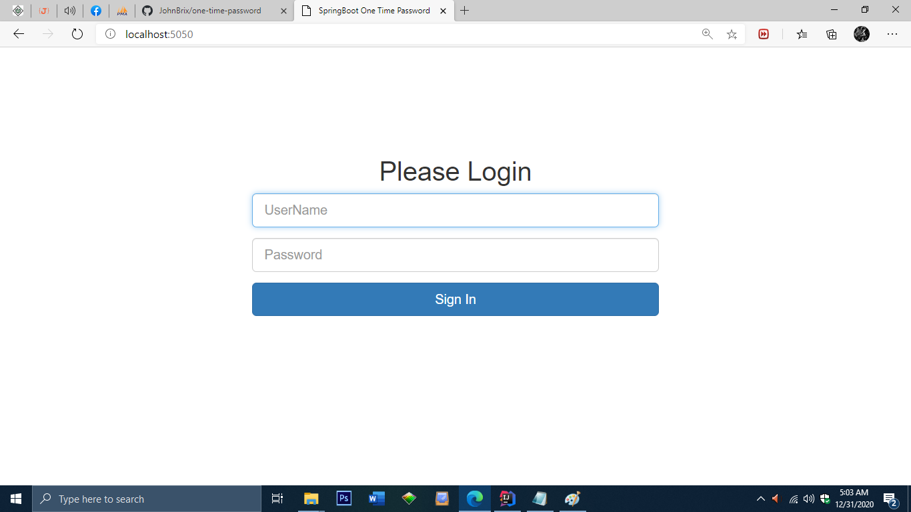
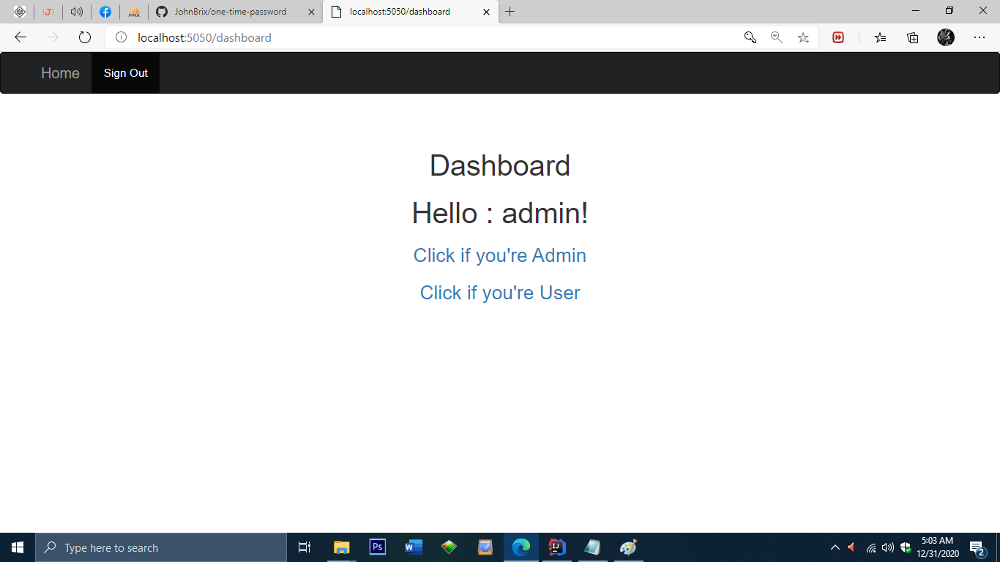
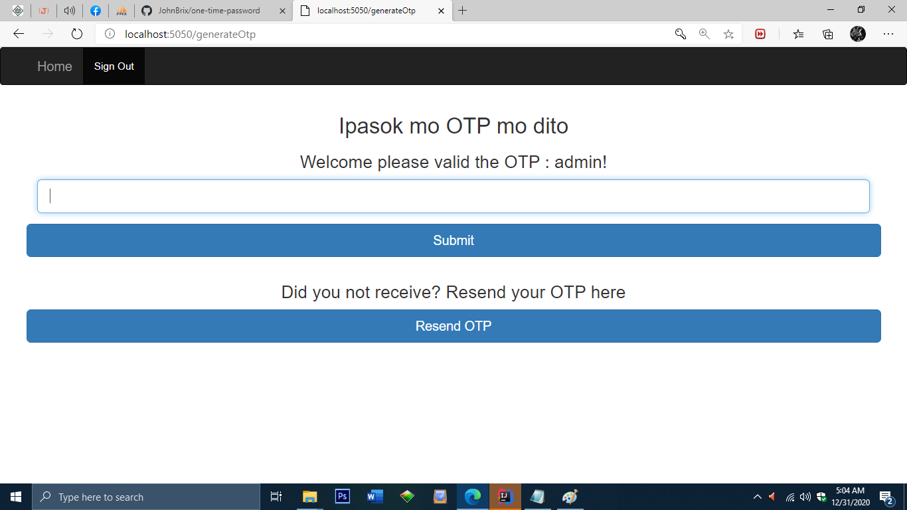

# OneTimePassword
One Time Password Using Spring Boot Java

<h1>Requirements needed: </h1>

- Gmail account
- Mysql.
- Spring boot.
- Intellij Idea, Eclipse or any kind of IDE as long it support a Spring boot.

<h1>How to install: </h1>

- First Download the Project import in your Intellij Idea Ultimate or Eclipse.
- Second open the folder mysql, test.sql open this as notepad and create a database name 'test'.
- Third copy all the data in test.sql and open your sql command and paste there.
- Fourth put your gmail account and password in ApplicationProperties and go to Otp Controller with generateOtp change the parameter sendOtpMessage base on your needs.

<h1>Actual Client Side: </h1>

